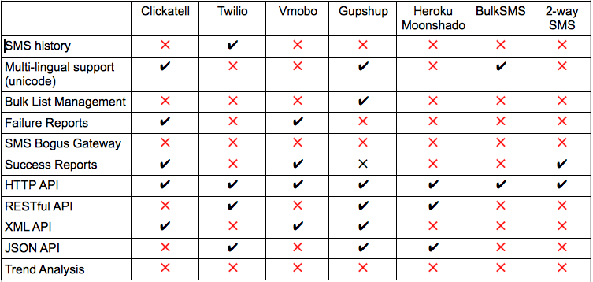

!SLIDE bullets incremental

# Motivated?

* So, SMS as MobileVAS is cool.
* Just do it!

!SLIDE bullets incremental

# So how does one start ?

* Choose a vendor! 
* (???)
* Implement the API
* (???)

!SLIDE center

# Vendor Analysis #

!SLIDE center

# Vendor Analysis #

!SLIDE bullets 

# So how does one start ?

* Choose a vendor! 
* ( Clickatell, Twilio, Tropo, BulkSMS, vMobo, ...)
* Implement the API
* (HTTP, XML, REST, JSON, ... )

!SLIDE center

# All the best!

!SLIDE bullets

# Hmm.. Choices! Choices!

* What the hell? Choose *anyone*
* Resolve issues later!

!SLIDE bullets incremental

# But.. the nagging doubts linger!

* Did I choose the right vendor?
* Can I afford to change the vendor now?
* Is there some standard for SMS API?
* Argh! Its too late for them!

!SLIDE bullets incremental

# The Solution?

* Hire some unwitting developer!
* Outsource to India? ;)

!SLIDE center 

# Nirvana 

# "Never fear SPlat is here"

