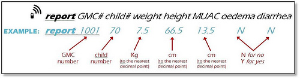

!SLIDE 

# 
SPlat
 #

# Sms Integration PLATform #

## Gautam Rege ##

## Josh Software, India ##

!SLIDE bullets

# About me 

* Co-Founded Josh Software - 2007
* Josh - exclusively in Ruby On Rails
* @gautamrege, @joshsoftware
* http://www.joshsoftware.com
* http://blog.joshsoftware.com

!SLIDE bullets incremental

# What is Mobile-VAS?

* Beyond Voice offering by Telcos.
* P2P (Person To Person): SMS, tunes, Caller tunes
* P2A & A2P: (Person <=> Application): SMS, IVRS
* Gaming & Data, MMS

!SLIDE bullets incremental

# Whats the business potential?

* Entertainment VAS
* Information VAS
* mCommerce VAS

!SLIDE bullets incremental

# Why SMS as Mobile-VAS?

* Smart Phones have limited audience
* Smart Phones are comparatively expensive 
* Smart Phones have limited accessibilty
* 
ALL mobiles and ALL providers

* 
SMS reaches a HUGE audience

!SLIDE bullets incremental

# Emotional Quotient - RapidSMS

* [Malawi - SMS to fight malnutrition](http://www.rapidsms.org/case-studies/malawi-nutritional-surviellence/)
* 

!SLIDE bullets incremental

# Emotional Quotient - RapidSMS

* Senegal - SMS Literacy Campaign.
* SMS as a communication tool. 
* Practical tool for learning and reinforcing literacy and numeracy skills

